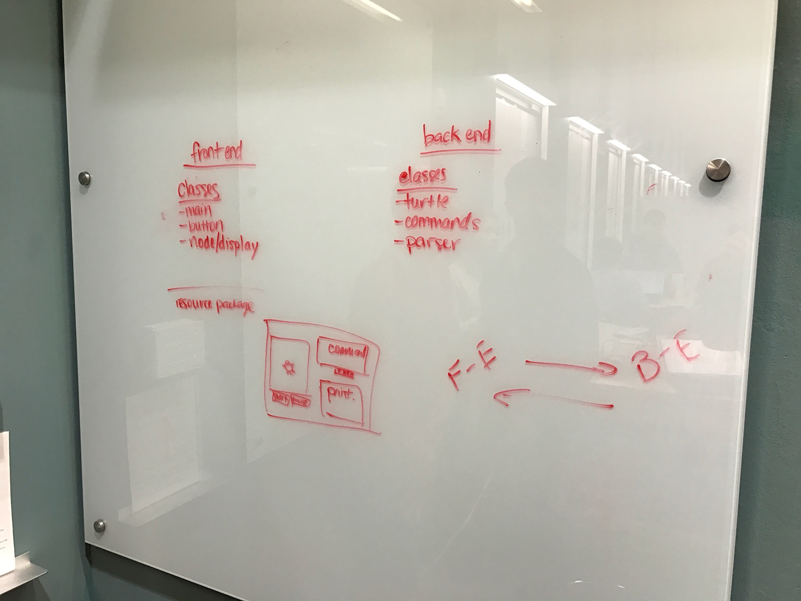
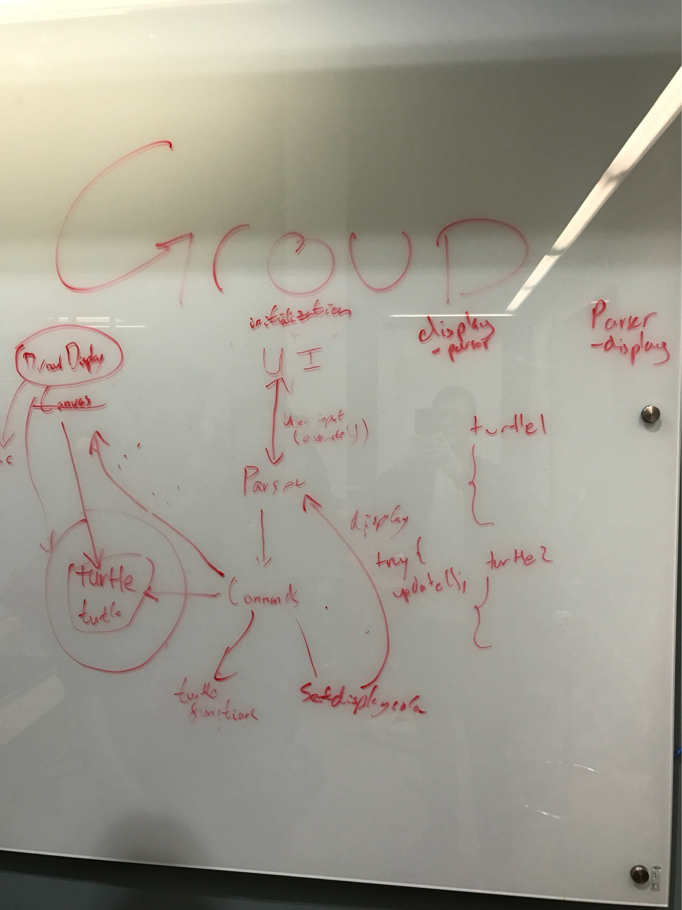

CompSci 308: API EXERCISE
===================

### SLOGO DESIGN ARCHITECTURE

1. When does parsing need to take place and what does it need to start properly?

Parsing takes place in the back-end through the use of a parser class that reads
the String passed and determines the command to execute. To start properly, the
front-end passes the String of the command that the user enters to the back-end to
be handled by the parser.

2. What is the result of parsing and who receives it?

The result of parsing is that the command is interpreted in a parser class in the back-end
and then passed to the Turtle class that calls the relevant command to update its state.

3. When are errors detected and how are they reported?

The errors detected are no command entered and incompatible command entered. The errors
are handled using a command exception class that throws the exception in the back-end and
the front-end receives these exceptions and prints out the error to the user in the print out
window.

4. What do commands know, when do they know it, and how do they get it?

The commands know their type when the command is called. The command also know its parameters
based on which subclass the parameter is in. For example, the move right by 50 command knows it
is a move command and it know the change in the right direction based on the amount of distance
it must move.

5. How is the GUI updated after a command has completed execution?

The GUI updates after a command has completed by checking the new location of the Turtle and
setting the location of the displayed turtle image to the user to the new location by moving 
from the old location.

### CRC Cards

