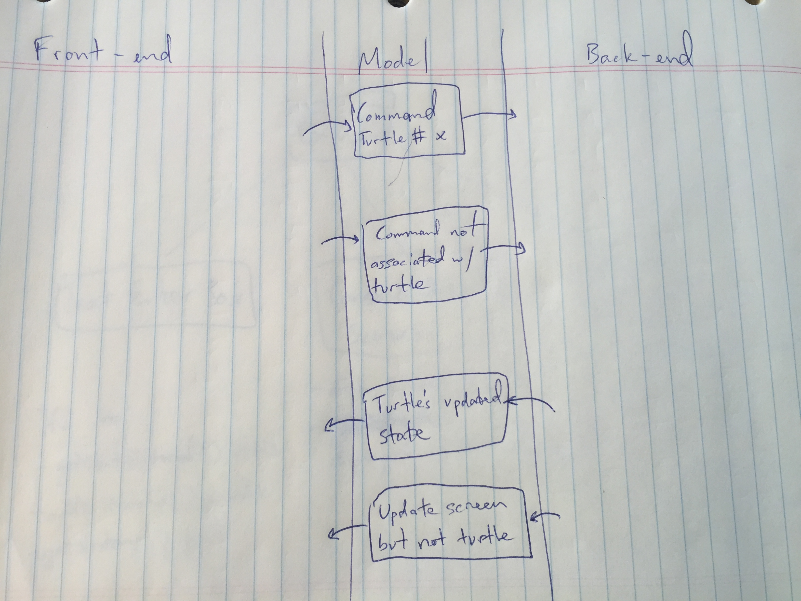
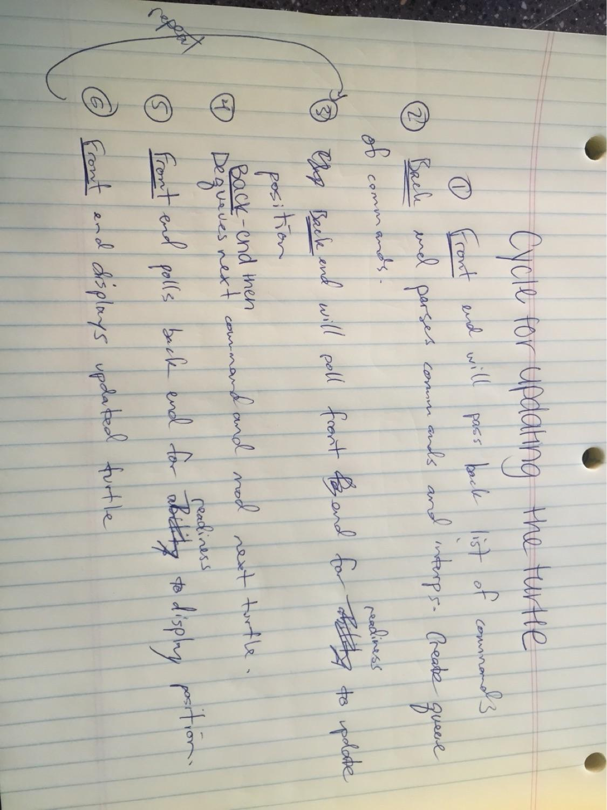
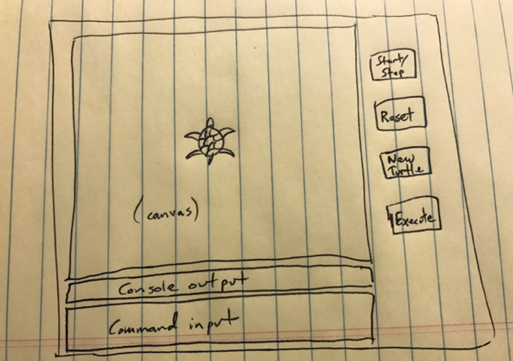

#SLogo
by: Alison Huang, Jake Conroy, Kyle Finke, Andres Lebbos, Daniel Li

##Introduction
Our program aims to essentially provide a reasonable facsimile of well known Logo programs such as MSWLogo. It should allow the user to input logo commands into a text box, which would then be parsed by the program and used to perform actions such as drawing with the turtle and printing to the console. The design is aimed to support multiple turtles and the execution of multiple lines of code, and is intended to be easy to refactor to support non turtle-specific commands. We also tried in our design to separate the command functionalities and the user display as cleanly as possible. In particular, drawing with the turtle should not directly influence the display canvas, and the only thing that the parser should receive from the user interface is a String input entered by the user. The display canvas only needs to know about the states of the turtles to update its display. Commands were also designed to be closed to further editing. Of the classes that we have design so far, all should be closed to modification, though the commands class should certainly be open to extension in the event that new commands were to be added to our program.

##Design Overview
The APIs we intend to create include the external/internal APIs for both the front-end and back-end. 
1. For the external API of the front-end, we will have a console input class that can store all user input that will be sent to the back end using an execute button that retrieves the text input of the console box then returns a string representation of everything currently in the console input and then deletes this from the input console. Beyond this, the external front end will include a reset button that will call a method, clear() that calls on the back end to reset all of the values held within the turtle and also clears the canvas in the front end of any drawn lines. Finally, the external front end will include a new turtle button that will pass a method, createNewTurtle(), which is of type void to the back end to add a turtle object to a list of turtles that is passed between the front and the back end. The internal API for the front end for the console output screen includes public void methods for getting the history of commands entered and displaying a command results. Each of these will have to be called by a step updating function in the canvas after a command is executed in the back-end. A getTextEntered() public String method in the console input will be called by the execute button within the front-end.
2. On the back end, we will have a Parser class that takes in potentially multi-line String inputs from the user and adds them to the end of its internal queue of Strings. Each Logo function is represented by a single class with a single execute() method and parameters that are set on construction. For each queue entry, the Parser will interpret the String on that line, and map each string component on that line to the corresponding function class. For each String that the Parser reads in, the Parser initializes a function class and attempts to pass it a number of constructor parameters based on the other Strings it has received. The parser then initializes the appropriate function classes, and passes the parameters it reads into the function classes. The parser then calls the functions to run their execute() methods. The TurtleCommands change parameters within the Turtle objects, so that the DisplayCanvas will draw lines based on differences between the Turtles' current and previous states.

##User Interface
The user will interact with the program mainly through a command line interface that will be displayed on the same scene as a console output screen and a canvas that draws the actions performed by the turtle(s). In addition, there will be several buttons on the user interface such as execute, start/stop, and reset. The execute button will be pressed by the user after he/she has entered all desired commands for execution by the turtle or otherwise. Below is an example of how we envision this looking in the end. Erroneous situations we envision include if the user inputs a command that is not found in our backend, if the command is correct but the parameters are not entered correctly, and if the turtle has gone off the screen. In the last situation, we will make the canvas scrollable, but will display an error message in the console output screen to let the user know that they should not originally see the turtle in their view.
(The sketch of the interface is in the images folder in our repository, called "user_interface.png").

##API Details
Below are various use-cases and how to handle them.

UC #1: The user wants to move the turtle forward 50 units. 
* The user will type "fd 50" into the command window and then will press the execute button, which will call the getUnexecutedCommands() method that calls the getTextEntered() method in the command window as a string and passes this to the parser class in the back-end which will use a map that determines which command class, if any, the command entered by the user corresponds to and then will pass this and the parameters, if any, to the appropriate command class (in this case the Forward class subclassed by TurtleCommand and the latter a class of CommandType) which will call the execute method within this class and change the associated turtle's y-position by 50 units in a private queue within the turtle object that stores all state changes made unto that turtle by user-inputted commands. The turtle within the turtle list that the canvas has access to will thus have a non-empty queue of state changes and will call the updateAllTurtleState() method and draw the corresponding location change on the canvas if the isPenDown() boolean is true. Meanwhile, when this command is added to the queue within the turtle, the front-end will also use the getHistory() method in the command window and the displayHistory() method in the display console to add this command to the environment's history and show it to the user.

UC #2: A turtle has been moved about the screen for awhile now and there is a fairly large trail behind it. The user presses the reset button on the GUI and the turtle returns to its original position, erasing all of the lines that have already been drawn.
* When the reset button is depressed, the sendClearCommand() method will be called and sent to the back end for parsing. The parser will decide that this is akin to the clearscreen command that can be entered in the console and return to the canvas that it should trigger its reset() method, which will clear the drawings currently on the canvas. Additionally, it will affect the turtle in that it will reset all of the current states to their default values (x=0, y=0, heading=0 degrees, etc.). The end result will be that the screen has no drawing on it and that the turtle has returned to its original position.

UC #3: A user has a turtle that he/she has been messing around with and then traces back over the trail it has already made and asks his/her friend to determine if the pen is currently down for the turtle. 
* Since the friend knows that the turtle has retraced its steps, he/she must query to the command line interface: pendown. When he/she presses execute, the button will trigger the getUnexecutedCommands() method that calls the getTextEntered() method in the command window as a string and passes this to the parser class in the back-end which will use a map that determines which command class, if any, the command entered by the user corresponds to and then will pass this and the parameters, if any, to the appropriate command class (in this case the Turtle class) to call the boolean method isPenDown() and send it back to the display console which will print the value of this method's return.

UC #4: A user wants to pause the animation so he/she can see what has been done already.
* The chunk of text that she entered originally as been sent to the back-end to be parsed and queued up to be actually displayed. The changes are made on the turtle at each step of the animation, and these changes are then described and printed out in the console. Each new command description will be on a new line, so the user can pause the animation by clicking the pause button. This will pause the Canvas's animation. Then the user can scroll in the console output box to see what commands have been executed up to that point in time (since the last reset).

UC #5: The user presses the create turtle button in order to add a new turtle on the screen. Once pressed a new dialog is popped up and the user types the name and color of the turtle the person wants to create. 
* Once the create button in the last dialog is placed the action listener in the class where the button is held identifies and reads the turtle name and the color that is displayed through a JColorChooser a.k.a. the best thing ever! It passes theses parameters to the Parser by calling the addTurtle() method. The parser checks that in its Map of turtles there is no turtle with the given id and if there is it throws a respective exception but if there isn't it creates a turtle with the constructor and with the id as a name and a color to identify it and maps it in the map to its respective id. Once the turtle is added it is originally added at home (the center of the screen) and looking to the right, it has been added to the Map that is given as a List when needed all the turtles.

UC #6: The user wants to create a new command that is a combination of commands with the specific syntax (like a method).
* The user presses the execute button and which will call the getUnexecutedCommands() method that calls the getTextEntered() method in the command window as a string and passes this to the parser class in the back-end which will use a map to determine that this command does not exist so it will go ahead and create it. Then it will add this new command to the Map of command but it will not create a new class for such because the Map is a command name mapped to a List of ordered commands so it will simply create a new List and add it to the map.

UC #7: The user wants to move towards (10,6).
* Towards class is called with the variables (10,6) representing the direction the turtle should point: the Towards class, a subclass of TurtleCommands, which is called using the execute(Turtle t) method, will get the last TurtleState object from the queue inside the Turtle it is passed (t.getFinalTurtleState()) and based on the current location of the Turtle will calculate the angle of the heading the Turtle must have to point towards (10,6). Then the Towards class will create a new TurtleState object (assumed it is called info) and pass this to the Turtle to add to the queue of TurtleState objects (t.addTurtleState(info)).

UC #8: The user wants to randomly pick a number from 0 to 100.
* Random class is called with the variable 100 representing the max number a random number can be: the Random class, a subclass of MathCommands, returns Math.random()*100 to the CommandParser class.

UC #9: The user wants to draw a trail using a turtle with more than one TurtleState in its queue.
* This is implemented using the Turtle's makeNextTrail function. When the makeNextTrail function is called on a Turtle, the Turtle dequeues its first TurtleState from the queue, and uses the getter methods within the TurtleState to define the start position and start colors of a line, as well as whether the pen is down or not. The Turtle then peeks at the next element of the queue, and uses the getter methods within that TurtleState to set the end positions of a line. The specifications of this line is then returned in the form of a TurtleTrail. (Exceptions are thrown if the turtles has less than two TurtleStates in its queue.) Hence, when the display canvas iterates through each turtle in its collection, it calls makeNextTrail on each turtle with more than two TurtleStates in its queue, and draws trails using the parameters returned. It then draws the turtles based on the position, orientation and colors specified in the Turtle's getter methods. 

UC #10: The user wants to change one of the turtles color to blue.
* A new TurtleState is added to the Turtle's queue, which is identical to the previous TurtleState but for the fact that the color has been set to blue. The code would be: addTurtleState(turtle.getX(),turtle.getY(), turtle.penIsUp(), turtle.isVisible(), Color.BLUE). Once the Turtle has used makeNextTrail enough times until the blue TurtleState is at the head of the queue the display canvas will call Turtle's getColor() when drawing the turtle and find that the color stored in the turtle is blue. Hence the turtle sprite will be drawn as a blue item.

##API Example Code
###Backend - External API

	//This class is responsible for reading in strings from the text input box, which could possibly be multiple lines of code, placing them in a queue, and parsing the strings line by line by calling appropriate functions.
	
	//Root class from back-end in terms of UML distribution
	public interface Parser{
		
		//The CommandParser receives the turtles, and the code it is going to interpret
		public CommandParser(HashMap<String,Turtle> turtles, String code); 
		
		//Returns a copy of the current list of turtles the back end is using if needed.
		public List<Turtle> getTurtles();
		
		//Adds the turtle to the list
		public void addTurtle(Turtle t);
	
		//Reads in a command, splits it line by line, and instantiates the appropriate class to call its execute method.
		public void addCode(String s);
	
		//Execute the next command in a list of commands
		Public String doNextCode();
	
		//return true if there is another command to execute
		Public boolean hasNextCode();
	}
	
	
	//A TurtleState is essentially an object designed to store position, pen color, and whether the turtle is drawing or not. The Turtle stores a queue of positions, and generates TurtleTrails based on the first and second TurtleStates within its queue. The queue is modified slightly so that the queue can return the element at both its head and its back. The head element of the queue corresponds to the Turtle's current state, and the back end correspond to the Turtle's final state- until a new element is added.
	
	public interface Turtle{
	
		//Looks at the first and second elements at the head of the TurtleQueue, and uses them to generate a turtle trail. Also dequeues the first element of the queue.
		public TurtleTrail makeNextTrail() throws StateNotFoundException;
		
		//Adds a new element to the back of the queue, corresponding to the latest change of state to be performed once the previous ones have been dealt with.
		public void addTurtleState(double x, double y, boolean penUp, Color penColor);
		
		public void getFinalTurtleState();
	
		//Returns variables corresponding to the Turtle's current state.
		public double getX();
	
		public double getY();
	
		public double getHeading();
	
		public boolean isPenDown();
	
		public boolean isShowing();
	
		private interface TurtleState(){
			public double getX();
			public double getY();
			public boolean penIsUp();
			public Color penColor();
		}
	
		//Used by the canvas display to draw lines
		private interface TurtleTrail(){
			public TurtleTrail(int x1, int y1, int x2, int y1, int y2, boolean penUp, Color penColor);
			public double getX1();
			public double getX2();
			public double getY1();
			public double getY2();
			public boolean penIsUp();
			public Color penColor();
		}
	}

###Backend - Internal API
The internal API for the backend supports the execution of the various possible commands that can be entered in the command prompt. The turtle command class of this API requires a Turtle object as a resource to work properly so that it can implement the command it receives on the turtle. This API is intended to be used by the external backend API CommandParser class which interprets a command and executes that command by calling the appropriate command in the internal backend API. This API could be extended by adding new subclasses to either the Command class, or the subclasses of the Command class can add their own subclasses for new commands. We chose to make an overarching command class to organize all of the possible commands under one parent. Then, we decided to create the subclasses TurtleCommand, MathCommand, and BooleanCommand to group commands based on their intended purpose. For example, TurtleCommand has a subclass for all of the possible commands that can be called on a Turtle to change its state. This separation of classes makes it easy to extend the Command class to create a new group of commands while also making it easy to add new commands to an existing group of commands, such as TurtleCommands. It also follows the open-closed principle because adding new Commands does not require changing pre-existing classes thereby preventing against errors caused by altering commands that already exist when trying to add new commands.

	
	//The Command class is the highest class in the command hierarchy and allows the subclasses to be //organized by the type of commands they implement
	public abstract Command{}
	
	//The TurtleCommand class extends Command and is the parent class to all individual commands that //may be called on a Turtle
	public interface TurtleCommand extends Command{
		//The execute method is implemented in all of the TurtleCommand subclasses. It is passed a Turtle object on which each subclass performs its specific command to alter the state of the Turtle.
		Public void execute(Turtle t);
	}
	
	//The MathCommand class extends Command and is the parent class to all of the possible math commands
	public interface MathCommand extends Command{
		//The execute method is implemented in every MathCommand subclass. It determines when the //specific MathCommand subclass should perform its specific command.
		Public void execute();
	}
	
	//The BooleanCommand class extends Command and is the parent class to all of the possible boolean commands
	public interface BooleanCommand extends Command{
		//The execute method is implemented in every BooleanCommand subclass. It determines when //the specific BooleanCommand subclass should perform its specific command.
		Public void execute();
	}

###Frontend - External API
The external API for the front-end is essentially what we have to offer to the back-end. Our goal was to minimize this so as to keep it as clean and simple as possible (as user-friendly as possible). Ultimately, what is needed from the front-end to be used by the back-end is the text that is initially inputed by the user. 

	//This is where it all starts! The components of the front and the back-end will be instantiated here.
	public class Main(){
		public static void main();
	}
	
	//This super-class is the highest in the hierarchy for all 3 of the windows that will be displayed on the stage. Each of the 3 windows will then extend it.
	public abstract class GUI(){}
		//This method will be implemented by all of the windows when the user wants to reset the screen back to the initial state.
		public abstract void clearContents();
	}
	
	//This is a subclass of GUI that will be used by the user to enter commands.
	public interface TextInput extends GUI(){
		//This method will retrieve the text that was just entered by the user and return it as a single string.
		public String getTextEntered();
		
		//To clear out the contents of what was entered
		public void clear();
	}
	
###Frontend - Internal API
The internal API is more detailed than the external. The way we broke down our work was in two main parts: a superclass GUI that will encompass the three main windows on the screen (Text Input Box, Console Output Box, a Canvas), and a superclass Buttons that encompasses all of the buttons that will be made on screen. Each of these windows will have separate functions. The Text Input Box is where the user will enter the commands he/she wants to execute. The Console Output Box will display a string describing the command that is being executed at that moment in time. The Canvas will be where the animation will be displayed (the turtles and the lines they might draw). The buttons being drawn include: an execute button that the user will press once he/she has put in all the desired commands, a start and stop button that will control the canvas animation, a new turtle button that will create a new turtle to play with and put on the canvas, and a reset button which will erase all three of the windows and bring them back to their initial states.
	
	
	//This subclass will be where text will be displayed for the user to read. This is NOT where the turtles go, but will display a description of each command as it is executed.
	public interface ConsoleOutput extends GUI(){
		//Every time a command is executed, it will need to be displayed
		public void displayCommand();
		
		//If the user wants to clear out the history contents of what was already executed, we will erase all of the previous text that has been displayed.
		public void clear();
	}
	
	//This subclass is where the turtles will be displayed. It has its own animation and the methods inside it will update the display of the turtle(s). It needs information from other places in the program but doesn't need to provide any services to others, thus most methods are not public, but the animation will be accessible.
	public interface Canvas extends GUI(){
		public void clear();
	}
	
	//This is the superclass for all of the buttons.
	public abstract class Button();
	
	//The start and stop buttons will control the animation of the Canvas. This animation will be public and therefore accessible by the buttons.
	public interface StartBtn extends Button();
	public interface StopBtn extends Button();
	
	//If a user wanted to add new turtles, then a new instance of the Turtle class would be made. This button will notify the data structure holding the turtles to make a new one. The method is of type void and sends a message to the back end to add a turtle object to a list of turtles that is accessible by both ends.
	public interface NewTurtleBtn extends Button(){
		public void createNewTurtle();
	}
	
	//This button will call the public clear() methods in all three canvases when pressed.
	public interface ResetBtn extends Button();
	
	//This button is pressed when the user is done inputting his/her desired commands.
	public interface ExecuteBtn extends Button();

##Design Consideration
* The back end team disagreed on how the different commands would be implemented. One group member suggested implementing a TurtleCommand class that would receive the collection of turtles as a constructor parameter and contain functions corresponding to things such as "fd", "bk", and "rt" which would be called upon turtles. The latter option that we eventually decided on was to treat TurtleCommand as an interface with an execute() method to be overridden. Each function would be represented by a class that overrode the execute() method and received specific parameters in its constructors. They would then be initialized and have their execute methods called by the parser. The first method has the advantages of requiring less classes, but the second method is more in line with open closed principles because we would always add new classes to add functions instead of modifying existing ones.
* One of the main issues we discussed throughout the planning phase was which end of our program should be responsible for modifying turtle states. To this end, we discussed the pros of having the turtles in the front end. Mainly we saw this as beneficial because the turtles would need to be displayed in the front end, so keeping the actual turtle objects there could make it easier to handle their visualization. The cons for this idea, however, were many and included the fact that all modification of the turtles would need to take place in the back-end. Every command entered in the front-end necessarily must be parsed in the back-end and then whichever changes need to be made to the turtle would need to be passed forward (in what form we were unsure) to the front-end for modification of the turtle object's states there. For opposite reasons, we favored keeping the turtle objects in the back-end and simply maintaining the displaying of the turtles in the front-end. This requires relatively little information and could be read in from an image resource file. 
* Another issue that we considered was how to draw the turtle's movements on the canvas. Initially, Daniel suggested that we might have a canvas that both the front and back ends accessed, which stored a queue of commands to be performed on the turtles. This idea has pros that include easy accessibility throughout the entire program and  flexibility in terms of the back end being responsible for some commands while the front end being responsible for the rest. The cons of this include leaving too much of the actual GUI implementation up to the back end for our taste. We eventually decided that it would be best to update turtles states using individual queues for each turtle object that maintained different states that the turtle is in based on single commands. In this way the back end will create this queue based on what is entered in the console and the turtle will have a log that maintains each of its different positions for all of the commands entered. Then the entire turtle object can be passed to the front end and the queue read by the canvas to that the turtle's position can be iterated as items are dequeued, with lines drawn between different positions as necessary. We see this as a more clear separation of powers for the back and front ends where the back end doesn't have to worry about how the commands will be drawn and the front end doesn't have to worry about how the commands will be parsed.

##Team Responsibilities
* Jake and Ali will work on all things front end, with a further distinction coming later in the project. Likely we will each be responsible for building a few of the main screen items separately and will work together to ensure all styling and positioning of these items on the screen works well. 
* Daniel, Andres, and Kyle will work on the back end. Daniel will work on the Turtle class. Andres will create the CommandParser class. Kyle will write the code for all of the commands.
